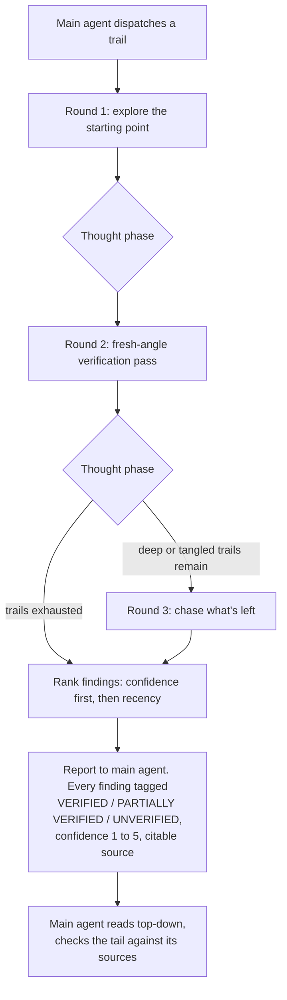

# Mainframe

My workspace repo. It holds an `AGENTS.md`, a set of Claude Code skills, and one subagent. Some of the skills I borrowed. The rest I built, and the subagent is mine too.

## What's here
Things I use on the daily to make my life just a bit simpler:

- **github-flow.** Mine. It teaches git and GitHub by making you type every command that changes state while it runs the read-only checks and calls the next move. I built it with skill-creator, and writing this README was its first real test drive.
- **grill-me** and **grilling.** Matt Pocock's pair. grill-me is the trigger and chains straight into grilling, which interviews you about a plan and maps it as a design tree, working the open questions a round at a time. Copied in as-is, then tuned. The questions now come five to a round instead of all at once, and the interview ends only when I say so, never when the model decides it has heard enough.
- **writing-for-agents.** Matt Pocock's skill for writing documents that agents read. Copied in as-is. Exceptionally effective.
- **unslop.** From Lauren Tan's pstack collection. It strips AI tells out of prose. Copied in as-is. No more "It's not X its Y" or annoying em dashes. Sentences get said plainly.
- **humanizer.** blader's skill (Siqi Chen). It rewrites AI-sounding prose so it reads like a person wrote it. Copied in from the official repo. I used to run it as a plugin, but pi cannot load plugins, so now it lives here as a plain skill that both harnesses read.
- **readme-update.** Mine. It keeps a project's README in step with what actually lives in its `.claude` or `.pi` folder. It checks each borrowed skill's license at the source, credits the author, and runs the new prose through unslop then humanizer. I built it this session, and this update is its first run.

And one subagent, mine:

- **haiku-explorer.** A dedicated explorer that runs on Haiku. The main agent hands it a trail of files, folders, or web links, and it follows that trail wherever it leads, then reports back with exact, citable sources. It never talks to me. It reports to the agent that spawned it, and the report is built to be cross-checked without a second look.

## How haiku-explorer works

The main agent dispatches it and waits. Hand it a trail, get back a ranked report. It explores in rounds and thinks after each one, and it never ends on a silent guess. Every finding comes back with a trust tag, VERIFIED, PARTIALLY VERIFIED, or UNVERIFIED, plus a confidence score from 1 to 5 and a source the main agent can open. Findings are ranked strongest first, by confidence, then by how recent they are. The main agent reads from the top, trusts the top, and checks the tail against the sources.

## Credits

The borrowed skills here are not mine, and all earned their place.

- **grill-me** and **grilling** by Matt Pocock. MIT, © 2026. https://github.com/mattpocock/skills
- **writing-for-agents** by Matt Pocock. MIT, © 2026. https://github.com/mattpocock/skills
- **unslop** by Lauren Tan, from the pstack collection. MIT, © 2026. https://github.com/cursor/plugins
- **humanizer** by blader (Siqi Chen). MIT, © 2025. https://github.com/blader/humanizer

Every vendored skill is MIT, so a `LICENSE` file rides along in each of their folders. github-flow, the readme-update skill, and the haiku-explorer subagent are mine.

This README went through unslop, then humanizer, before it landed here. Fitting, given what two of these skills do.
