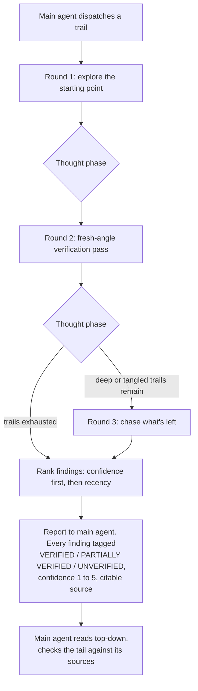
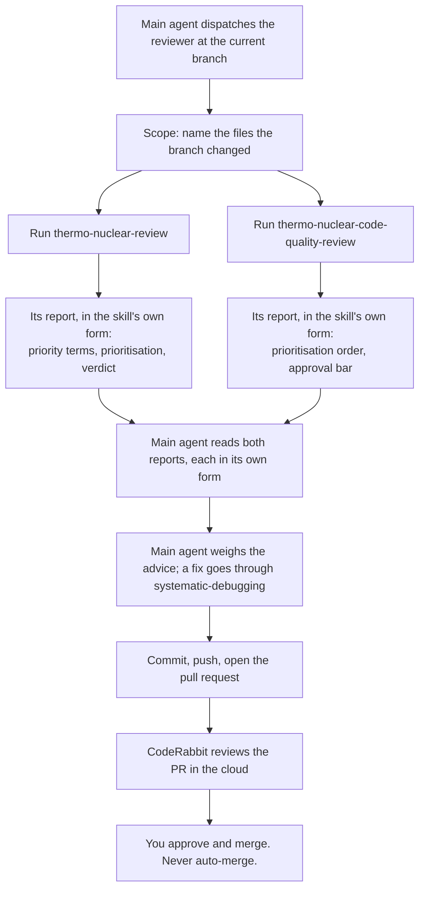

# Mainframe

My workspace repo. It holds an `AGENTS.md`, a set of Claude Code skills, and two subagents. Some of the skills I borrowed. The rest I built, and the subagents are mine too.

## What's here
Things I use on the daily to make my life just a bit simpler:

- **github-flow.** Mine. It teaches git and GitHub by making you type every command that changes state while it runs the read-only checks and calls the next move. I built it with skill-creator, and writing this README was its first real test drive.
- **grill-me** and **grilling.** Matt Pocock's pair. grill-me is the trigger and chains straight into grilling, which interviews you about a plan and maps it as a design tree, working the open questions a round at a time. Copied in as-is, then tuned. The questions now come five to a round instead of all at once, and the interview ends only when I say so, never when the model decides it has heard enough.
- **writing-for-agents.** Matt Pocock's skill for writing documents that agents read. Copied in as-is. Exceptionally effective.
- **unslop.** From Lauren Tan's pstack collection. It strips AI tells out of prose. Copied in as-is. No more "It's not X its Y" or annoying em dashes. Sentences get said plainly.
- **humanizer.** blader's skill (Siqi Chen). It rewrites AI-sounding prose so it reads like a person wrote it. Copied in from the official repo. I used to run it as a plugin, but pi cannot load plugins, so now it lives here as a plain skill that both harnesses read.
- **readme-update.** Mine. It keeps a project's README in step with what actually lives in its `.claude` or `.pi` folder. It checks each borrowed skill's license at the source, credits the author, and runs the new prose through unslop then humanizer. I built it this session, and this update is its first run.
- **tui-design.** gfargo's skill. It teaches how to design a terminal interface that reads well: layout, spacing, colour restraint, visual hierarchy, resize and error handling. Copied in as-is. pi draws its own screens with its own TUI library rather than Ink, so I take the design doctrine and leave the Ink-specific reference alone.
- **systematic-debugging.** Jesse Vincent's skill, from his superpowers collection. It makes you find the root cause before you touch a fix, and it names band-aids and test-editing for what they are. This is my guard against the monkey-patching that sank my last attempt. Copied in with its reference files.
- **thermo-nuclear-review** and **thermo-nuclear-code-quality-review.** Cursor's pair. The first audits a branch's diff for bugs, breaking changes, security holes and feature-gate leaks. The second is a harsh maintainability review that hunts over-engineering and spaghetti. My reviewer subagent runs both. Copied in, with model invocation switched on so the reviewer can call them.

One more, installed rather than copied in, is **ponytail**, Dietrich Gebert's minimalism ruleset that keeps an agent reaching for the shortest solution that works. Its whole point is to stay active for a full session, and that needs the plugin and extension hooks a plain skill does not have, so it does not live in this repo. It runs as a Claude Code plugin and as a pi extension, each installed straight from its own repo.

And two subagents, both mine:

- **haiku-explorer.** A dedicated explorer that runs on Haiku. The main agent hands it a trail of files, folders, or web links, and it follows that trail wherever it leads, then reports back with exact, citable sources. It never talks to me. It reports to the agent that spawned it, and the report is built to be cross-checked without a second look.
- **reviewer.** Runs on Opus. The main agent points it at the current branch, and it reviews the branch by running both thermo-nuclear skills, returning each skill's report in that skill's own form: its own severity terms, prioritisation, and verdict. It lays no template, ranking, or verdict of its own over the top of them, and it never edits, commits, or fixes. The findings are advice, and any fix that follows goes through systematic-debugging.

## How haiku-explorer works

The main agent dispatches it and waits. Hand it a trail, get back a ranked report. It explores in rounds and thinks after each one, and it never ends on a silent guess. Every finding comes back with a trust tag, VERIFIED, PARTIALLY VERIFIED, or UNVERIFIED, plus a confidence score from 1 to 5 and a source the main agent can open. Findings are ranked strongest first, by confidence, then by how recent they are. The main agent reads from the top, trusts the top, and checks the tail against the sources.

## How the reviewer works

The main agent points it at the current branch and waits. It reviews the branch by running the two thermo-nuclear skills over the changes. Each skill it invokes brings its own instructions and its own way of reporting, so each report comes back in that skill's own form: its priority terms, its prioritisation order, its approval bar. The reviewer lays no format of its own over the top, does not merge the two or rank one against the other, and writes no verdict the skills did not give. Its only additions are a scope line naming the changed files and a heading over each report. The findings are advice, and a fix goes through systematic-debugging, not through the reviewer.

## Credits

The borrowed skills here are not mine, and all earned their place.

- **grill-me** and **grilling** by Matt Pocock. MIT, © 2026. https://github.com/mattpocock/skills
- **writing-for-agents** by Matt Pocock. MIT, © 2026. https://github.com/mattpocock/skills
- **unslop** by Lauren Tan, from the pstack collection. MIT, © 2026. https://github.com/cursor/plugins
- **humanizer** by blader (Siqi Chen). MIT, © 2025. https://github.com/blader/humanizer
- **tui-design** by gfargo. MIT, © 2026. https://github.com/gfargo/tui-design-skill
- **systematic-debugging** by Jesse Vincent, from the superpowers collection. MIT, © 2025. https://github.com/obra/superpowers
- **thermo-nuclear-review** and **thermo-nuclear-code-quality-review** by Cursor. MIT, © 2026. https://github.com/cursor/plugins

ponytail, by Dietrich Gebert (MIT), is not in this list because it is installed rather than copied in, so its files never enter this repo. https://github.com/DietrichGebert/ponytail

Every vendored skill is MIT, so a `LICENSE` file rides along in each of their folders. github-flow, the readme-update skill, and both subagents, haiku-explorer and reviewer, are mine.

This README went through unslop, then humanizer, before it landed here. Fitting, given what two of these skills do.
