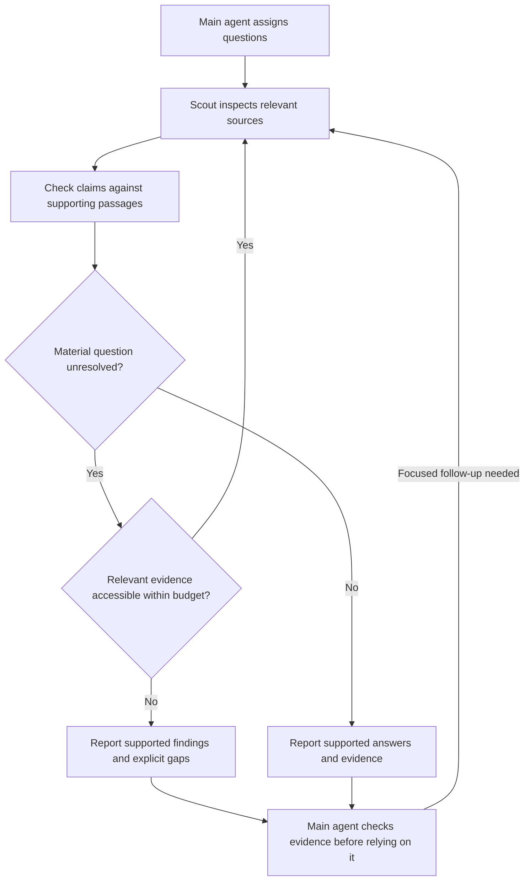
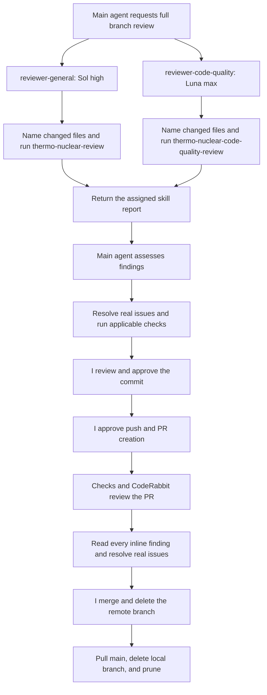

# Mainframe

My workspace repo. It holds an `AGENTS.md`, eleven skills shared by Codex and Pi, and three Codex subagents. Some of the skills I borrowed. The rest I built, and the subagents are mine too.

## Where things live

`.agents/` is the single source of truth. Codex reads skills directly from `.agents/skills/`. Each skill has an `agents/openai.yaml` file for Codex metadata and invocation policy. Pi reaches the same skills through a directory junction. Codex reaches the subagents through a separate junction.

```text
.agents/
  skills/          <- Codex reads here directly
  agents/          <- canonical subagent TOML files
.pi/skills         -> .agents/skills
.codex/agents      -> .agents/agents
```

Edit the files under `.agents/`. This setup shares skills with Pi; the subagents are for Codex. Ponytail stays separately installed in each harness.

The junctions are local Windows links, ignored by Git. On a fresh checkout, run these commands from the repository root to recreate them. The two link paths must be absent; inspect any existing paths before replacing them.

```powershell
New-Item -ItemType Directory -Path .pi, .codex -Force
New-Item -ItemType Junction -Path .pi/skills -Target (Resolve-Path .agents/skills).Path
New-Item -ItemType Junction -Path .codex/agents -Target (Resolve-Path .agents/agents).Path
Get-Item .pi/skills, .codex/agents | Select-Object FullName, LinkType, Target
```

## What's here

Things I use on the daily to make my life just a bit simpler:

- **github-flow.** Mine. It teaches git and GitHub by making you type commands that change state while it runs the read-only checks and calls the next move. You can explicitly ask it to take over. I built it with skill-creator, and writing this README was its first real test drive.
- **grill-me** and **grilling.** Matt Pocock's pair, tuned for my workflow. grill-me invokes grilling, which interviews you about a plan and maps its decisions as a design tree. It asks at most five questions per round, and the interview ends only when I say so.
- **writing-for-agents.** Matt Pocock's skill for writing documents that agents read. Exceptionally effective. Its skill mechanics reference is adapted for Codex and Pi.
- **unslop.** From Lauren Tan's pstack collection. It strips AI tells out of prose. No more annoying em dashes or stock contrast phrases. Sentences get said plainly.
- **humanizer.** blader's skill, by Siqi Chen. It rewrites AI-sounding prose so it reads like a person wrote it. It lives here as a plain skill that both harnesses read.
- **readme-update.** Mine. It keeps a project's README in step with its skills and agents under `.agents/`, `.codex/`, and `.pi/`. It checks borrowed skills' licenses at the source, credits the authors, and runs new prose through unslop then humanizer.
- **tui-design.** gfargo's skill. It teaches terminal layout, spacing, colour restraint, visual hierarchy, resize and error handling. I use its design guidance for Pi's terminal interfaces.
- **systematic-debugging.** Jesse Vincent's skill, from his superpowers collection. It makes you find the root cause before touching a fix. This is my guard against the monkey-patching that sank my last attempt. Its reference files are included; the workflow uses the checks available in the current harness.
- **thermo-nuclear-review** and **thermo-nuclear-code-quality-review.** Cursor's pair. The first audits a branch's diff for bugs, breaking changes, security holes and feature-gate leaks. The second is a harsh maintainability review that hunts over-engineering and spaghetti. I run one reviewer subagent per skill, each with its own context.

One more, installed rather than copied in, is **ponytail**, Dietrich Gebert's minimalism ruleset. It keeps an agent reaching for the shortest solution that works. It is installed separately as a Codex plugin and a Pi extension, so its files do not live in this repo.

And three subagents, all mine:

| Agent | Model | Reasoning effort | Job |
|---|---|---|---|
| scout-master | `gpt-5.6-luna` | `medium` | Investigate files and web sources; return evidence and material gaps. |
| reviewer-general | `gpt-5.6-sol` | `high` | Run thermo-nuclear-review for bugs and security. |
| reviewer-code-quality | `gpt-5.6-luna` | `max` | Run thermo-nuclear-code-quality-review for maintainability. |

All three are configured read-only and instructed to report without changing files. Effective permissions also depend on the parent session's runtime settings. Their reports are evidence to assess, not permission to make changes.

## How scout-master works

The main agent assigns questions. Scout inspects relevant files and web sources, following related evidence when it can change the answer or establish its validity. Before reporting, it re-reads the supporting passages and checks the claims, citations, applicability, contradictions, and coverage.

Scout distinguishes observed facts from inferences and unresolved questions. Findings include local file paths and exact line numbers or direct web links. Decision-changing claims include short supporting excerpts where useful. Date-sensitive or version-sensitive findings state which date or version applies.

It finishes when the answers are supported and checked. If access, tools, or an assigned budget prevents completion, it reports what remains unknown and what would settle it. Broken links and empty folders stay in the report when they answer the question or limit the conclusion. Findings come in order of importance to the task, with evidence and limitations beside them.



Scout's essential instructions live directly in its agent file. Reading instructions does not guarantee compliance, so the main agent checks the returned evidence and asks focused follow-up questions when support is missing.

## How the reviewers work

Each reviewer reads its assigned skill and reviews committed changes from the common ancestor of `main` and the current branch to the branch tip. Uncommitted working files are outside that comparison. The reviewer names the changed files, then returns the skill's report under its own heading, preserving its priority terms, ordering, and approval bar where defined.

For a full review, the main agent runs both reviewers. They report advice and do not apply fixes. Fixes go through systematic-debugging and the applicable checks. I review the result before committing, separately approve publishing the branch and opening a PR, and handle the merge myself.



## Credits

The borrowed skills here are not mine, and all earned their place. Each borrowed skill folder includes its MIT license. Some workflow instructions and harness metadata have been adapted for this setup.

- **grill-me**, **grilling**, and **writing-for-agents** by Matt Pocock. MIT, copyright 2026. [Source](https://github.com/mattpocock/skills), [license](https://github.com/mattpocock/skills/blob/main/LICENSE).
- **unslop** by Lauren Tan, from pstack. MIT, copyright 2026. [Source](https://github.com/cursor/plugins/tree/main/pstack/skills/unslop), [license](https://github.com/cursor/plugins/blob/main/pstack/LICENSE).
- **humanizer** by blader, Siqi Chen. MIT, copyright 2025. [Source](https://github.com/blader/humanizer), [license](https://github.com/blader/humanizer/blob/main/LICENSE).
- **tui-design** by gfargo. MIT, copyright 2026. [Source](https://github.com/gfargo/tui-design-skill), [license](https://github.com/gfargo/tui-design-skill/blob/main/LICENSE).
- **systematic-debugging** by Jesse Vincent, from superpowers. MIT, copyright 2025. [Source](https://github.com/obra/superpowers/tree/main/skills/systematic-debugging), [license](https://github.com/obra/superpowers/blob/main/LICENSE).
- **thermo-nuclear-review** and **thermo-nuclear-code-quality-review** by Cursor. MIT, copyright 2026. [Source](https://github.com/cursor/plugins/tree/main/thermos/skills), [license](https://github.com/cursor/plugins/blob/main/thermos/LICENSE).

Ponytail is by Dietrich Gebert. Its upstream license is MIT, copyright 2026 DietrichGebert. It is installed separately. [Source](https://github.com/DietrichGebert/ponytail), [license](https://github.com/DietrichGebert/ponytail/blob/main/LICENSE).

github-flow, readme-update, and all three subagents are mine.

This README went through unslop, then humanizer, before it landed here. Fitting, given what two of these skills do.
